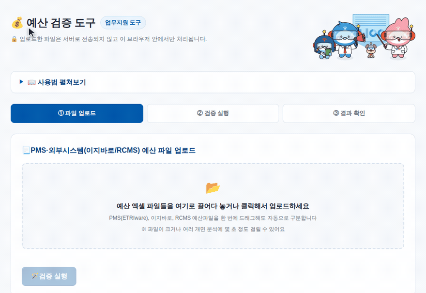

# 예산 검증 자동화
   
> **사내 업무지원 도구**\
PMS(내부망)와 외부시스템(이지바로·RCMS) 예산을 **비목별로 자동 대조·검증**해주는 웹 도구입니다.
설치·로그인 없이 브라우저에서 바로 쓸 수 있고, 서버 없이 전부 내 PC 안에서 처리됩니다.

## 🌐 바로 사용하기
**GitHub Pages** 👉 [lazy-mj.github.io/lazy-jeongsan](https://lazy-mj.github.io/lazy-jeongsan/)

---

## ✨ 주요 기능

- 🪄 **PMS·이지바로·RCMS 파일을 자동 인식**해서 업로드만 하면 어떤 시스템 파일인지 사람이 구분할 필요가 없어요
- ✅ **여러 과제를 한 번에 검증** — 파일을 여러 개 올려도 자동으로 인식하고, 직접 짝을 지어 한 번에 전체 검증할 수 있어요
- 🔒 **업로드한 파일은 서버나 페이지에 저장되지 않고, 오직 방문한 내 PC(브라우저) 안에서만 처리**되어 안전해요 — 예산 데이터가 외부로 전송될 일이 없습니다
- ⚠️ **비목별 이월예산·실행예산·집행실적·잔액을 자동 대조**하고, 값이 다른 항목은 바로 눈에 띄게 표시돼요
- 🌟 **짝짓기 오류도 자동으로 알려줘요** — 실행예산 총액이 비정상적으로 차이나면 "혹시 다른 과제 파일 아닐까요?" 하고 별도로 안내합니다
- 🔍 **분류표에 없는 세목은 "기타(미분류)"로 따로 모아** 누락되지 않도록 안내해요
- 💾 결과는 **과제별 시트로 나뉜 엑셀 파일로 다운로드** 가능

## 🚀 사용 방법

1. **파일 업로드** — PMS·이지바로·RCMS 예산 엑셀 파일을 한꺼번에 끌어다 놓으세요
2. **짝 짓기** (파일이 여러 개일 때) — 자동 인식된 파일 중 비교할 쌍을 직접 선택해 [짝 추가]
3. **검증 실행** — 비목별로 이월예산·실행예산·집행실적·잔액을 비교
4. **결과 확인** — 값이 다른 항목 확인, 필요하면 엑셀로 다운로드


## 🔒 보안 관련

- 네트워크 요청 코드가 전혀 없고, `Content-Security-Policy`로 외부 통신을 브라우저 단에서 차단해뒀습니다
- 업로드한 파일이나 계산 결과는 어디에도 저장되지 않으며 새로고침하면 모두 사라집니다 (별도 로컬 저장 없음)
- 다만 정적 페이지 특성상 소스 코드(계산 로직)는 누구나 열람 가능합니다 — 데이터만 비공개이며 코드 자체는 공개된 도구입니다

## 🛠 기술 스택

순수 HTML / CSS / JavaScript + [SheetJS(xlsx)](https://sheetjs.com/)로 만든 정적 웹앱입니다. 별도 서버·빌드 과정 없이 GitHub Pages로 바로 배포됩니다.

```
index.html          메인 페이지
css/style.css        스타일
js/
  config/            비목 분류 매핑 데이터
  core/               그리드 유틸 · 비교 계산 엔진
  systems/            PMS · 이지바로 · RCMS 어댑터
  ui/                 상태 · 렌더링 · 엑셀 내보내기
  main.js             이벤트 바인딩 · 초기화
  vendor/             xlsx 라이브러리 (직접 추가 필요)
assets/              썸네일 · 데모 이미지 등
```
